# Healthcare Data Analysis

## Overview

This project involves analyzing a healthcare dataset to uncover insights regarding patient demographics, medical conditions, hospitalizations, billing, and treatment outcomes. The analysis aims to identify patterns, trends, and potential areas for improvement in patient care and hospital management.

## Dataset

The dataset contains the following columns:
- Name (string)
- Age (integer)
- Gender (string)
- Blood Type (string)
- Medical Condition (string)
- Date of Admission (string)
- Doctor (string)
- Hospital (string)
- Insurance Provider (string)
- Billing Amount (float)
- Room Number (integer)
- Admission Type (string)
- Discharge Date (string)
- Medication (string)
- Test Results (string)

Total Entries: 55,500
Columns: 15

## Objectives

1. Identify the common medical conditions and their distribution among patients.
2. Analyze the correlation between patient demographics (age, gender, blood type) and medical conditions and treatment outcomes.
3. Determine the average billing amount for different medical conditions and hospitals.
4. Examine the variations in admission types and discharge dates across different hospitals and medical conditions.
5. Identify the most commonly prescribed medications and analyze the test results.

## Visualizations

### 1. Age and Gender Distribution for Each Medical Condition
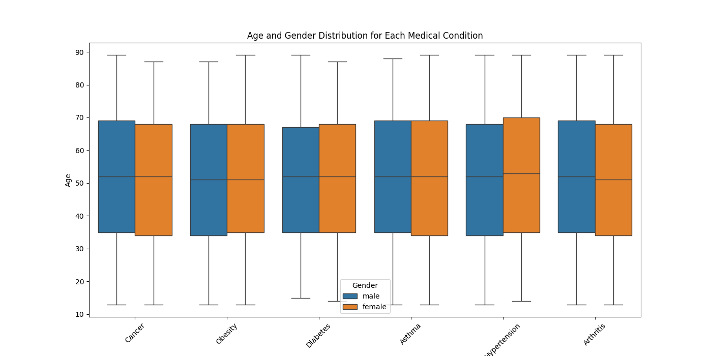

### 2. Average Billing Amount for Each Medical Condition
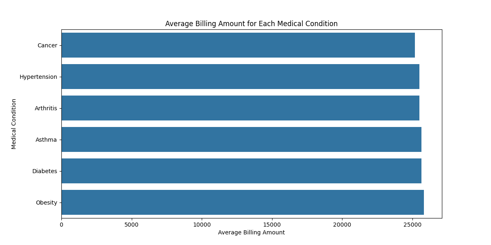

### 3. Correlation Matrix
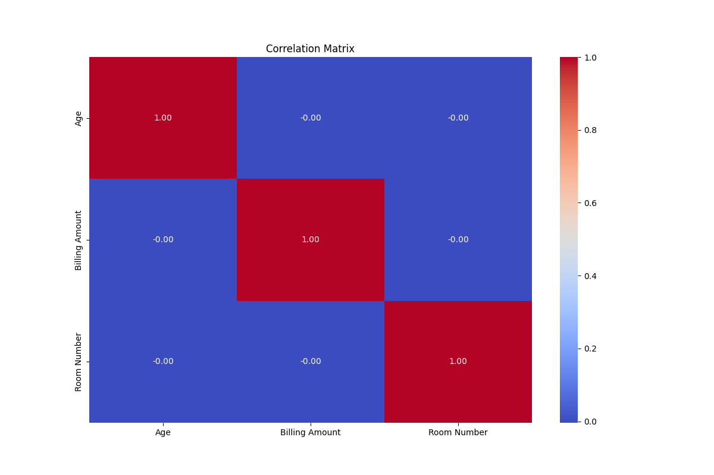

### 4. Distribution of Billing Amounts Across Different Insurance Providers
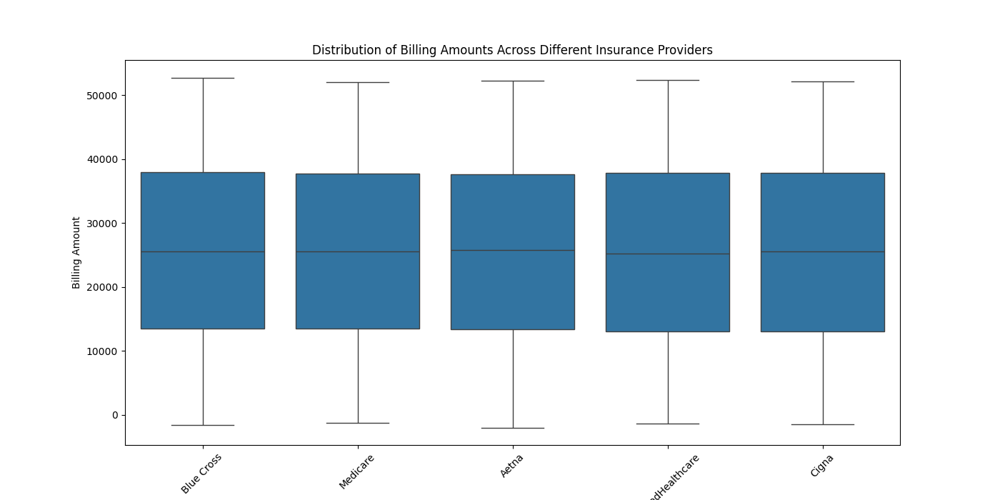

### 5. Distribution of Gender
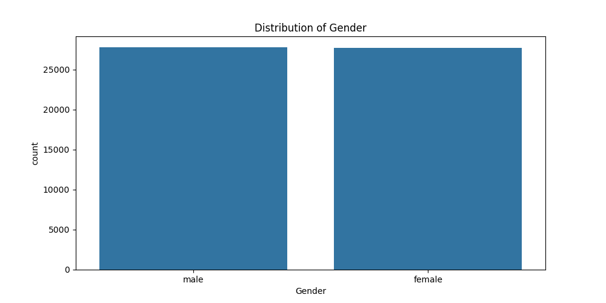

### 6. Distribution of Medical Condition
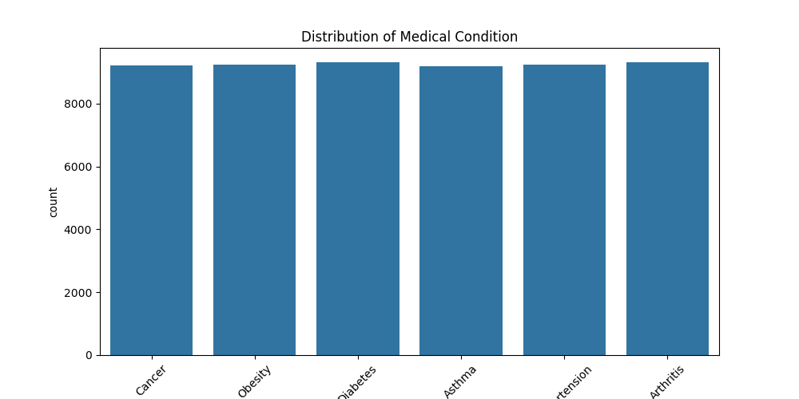

### 7. Distribution of Test Results for Different Medical Conditions
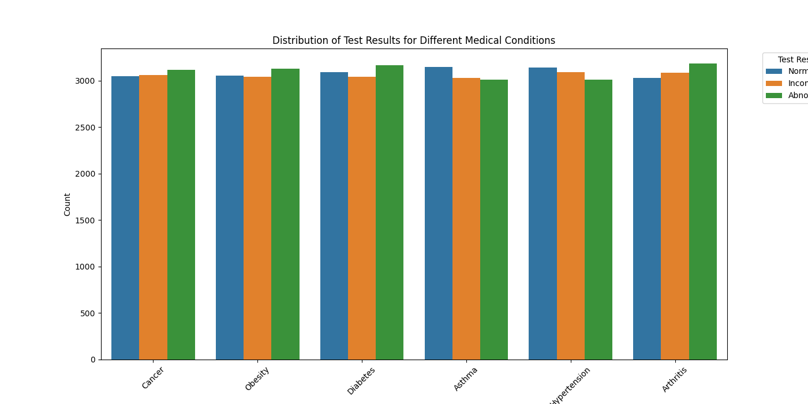

### 8. Most Commonly Prescribed Medications
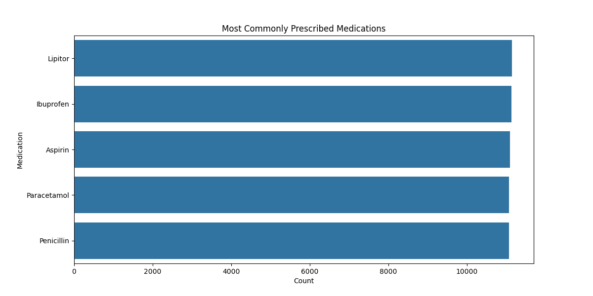

### 9. Average Billing Amount for Each Hospital
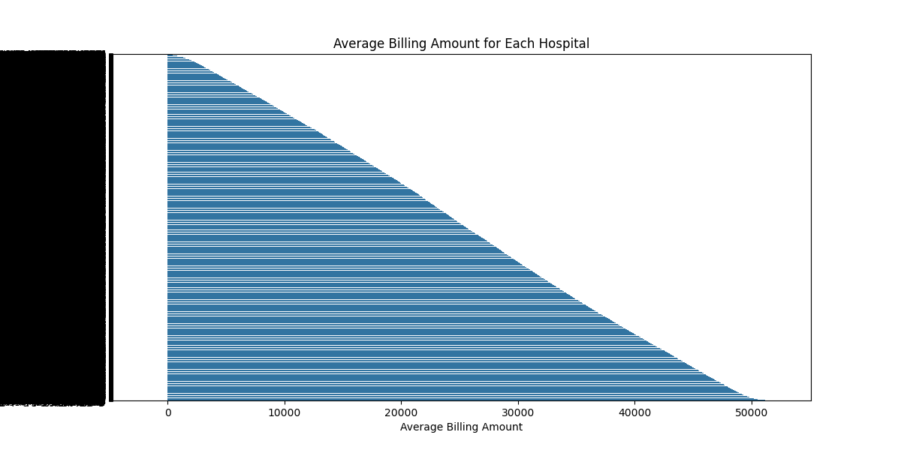

### 10. Correlation Between Medications and Test Results
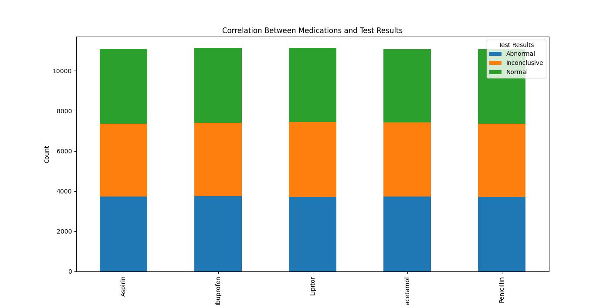

### 11. Distribution of Admission Types
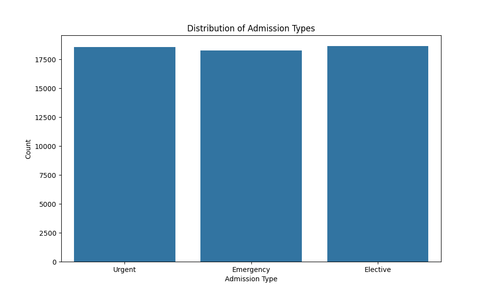

### 12. Distribution of Blood Type
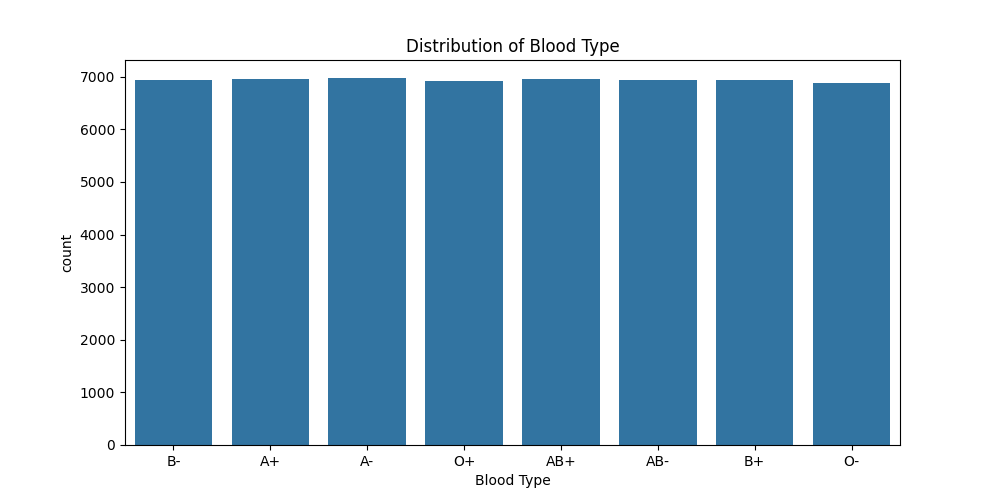

### 13. Distribution of Hospital Length of Stay
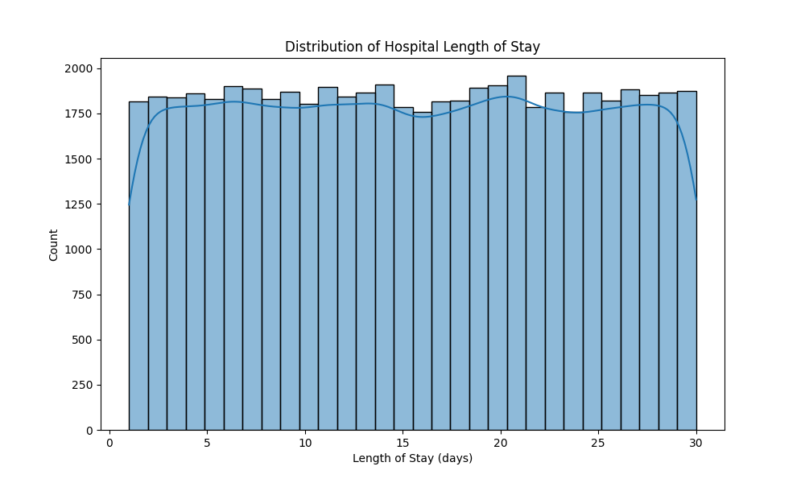

### 14. Distribution of Medical Conditions Across Different Hospitals
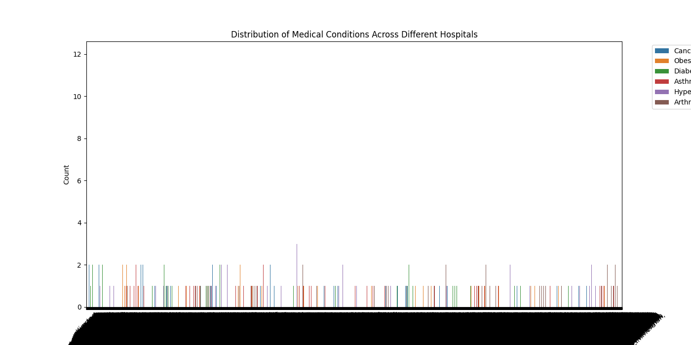

### 15. Frequency of Each Medical Condition
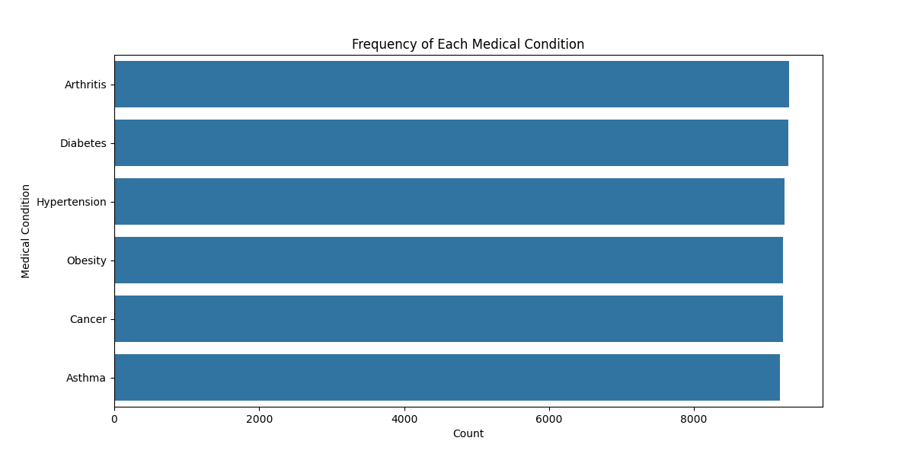

### 16. Trends in Admission and Discharge Dates Over Time
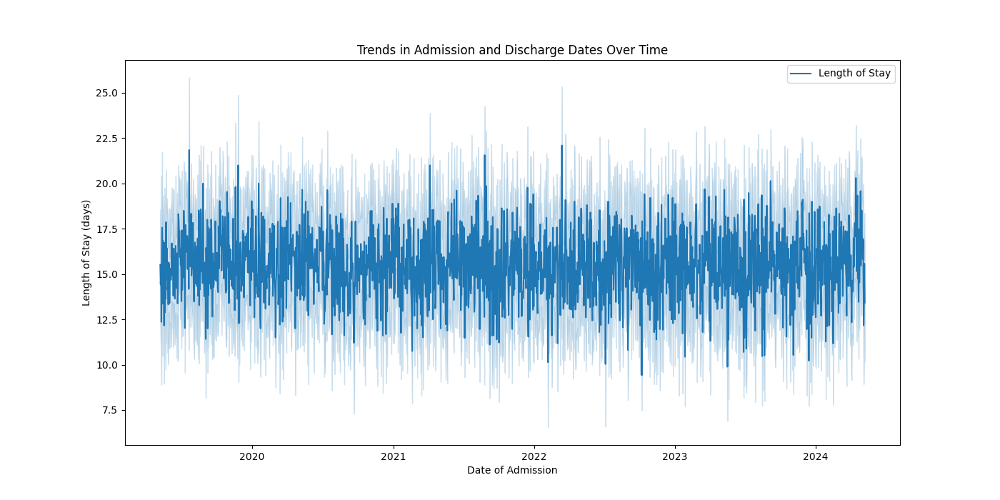

## Analysis

The analysis is conducted using the Jupyter notebook `Healthcare_Project.ipynb`, which includes the code to generate the above visualizations and perform detailed data analysis.

## Instructions to Run

1. Ensure you have Python and Jupyter Notebook installed.
2. Install the required libraries by running:
    ```bash
    pip install pandas matplotlib seaborn
    ```
3. Open the Jupyter notebook:
    ```bash
    jupyter notebook Healthcare_Project.ipynb
    ```
4. Run the cells in the notebook to perform the analysis and generate the visualizations.

## Conclusion

This project provides comprehensive insights into healthcare data, helping to understand patient demographics, medical conditions, billing, and treatment outcomes. The visualizations assist in identifying patterns and trends, aiding in better hospital management and patient care.

## Files

- `Healthcare_Project.ipynb`: Jupyter notebook containing the data analysis and visualization code.
- `healthcare_dataset_cleaned.csv`: Cleaned dataset used for analysis.
- Various PNG files containing the generated visualizations.
